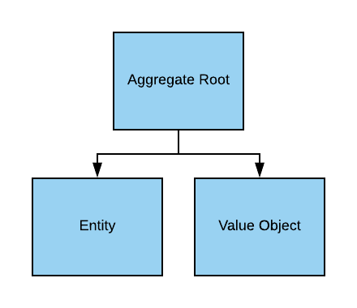

theme: Inter, 1
slide-dividers: #
footer: 
footer-style: #FFFFFF

# Domain Driven Design
## Tackling the Complexity in the Heart of Software

^Welcome. My name is Seth Kraut, and I’m here to talk to you about Domain Driven Design.

^I'll cover the overall concepts, but I will also emphasize where it matches well with Rails and where there may be issues..

# About Me

Seth Kraut
Senior Software Engineer @ Upstart

Slides and more are available at http://tech.sethkraut.com

 

^So, again, my name is Seth Kraut. I’m a Senior Software Engineer at Upstart, where we use machine learning to better evaluate credit risk. I have over 20 years of professional Java development experience, and over 6 months of professional Ruby development experience.

^In addition to a degree in Computer Science, I have an MBA. I don’t directly use my MBA, but it has influenced my code more than I expected. It’s especially informative when I think about software architecture.

^I love talking about technology, so if there is anything about this presentation that you’d like to discuss further, feel free to come talk to me, or you can connect with me at sethkraut on twitter or on my website, tech.sethkraut.com. 

^Also, I have cute kids.

---

^Domain Driven Design is a book written in 2003 by Eric Evans. It has been resurgent in popularity with the rise of microsevices. I read most of it in 2004, though more and more of it has registered over time. Most technical books are relevant for, at most, a few years. This one is on the short list of techinical books, like the Mythical Man Month, that are still worth reading a decade later.

^Domain Driven Design is an 800 page book, and it is rather densely written. People have generally read the tactical patterns, which is the first 400 pages. This section introduces things you’ve probably heard of like repositories, domain objects, and entities. These tactical patterns in Domain Driven Design are an object oriented, layered architecture. This is what you’d expect after hearing my summary of architecture around that time. This has also given people, myself included, the impression that Domain Driven Design requires this architecture. Instead, it is best understood as a reference architecture implementing the principles.

^It also means that people mostly missed the strategic patterns that comprise the second 400 pages of this book. In it, Eric Evans introduces higher level concepts like bounded context. This portion is also more abstract and more difficult to apply immediately. It’s this portion, in particular, that has become more relevant in light of microservices. This is because, it establishes some ideas about how to split applications into smaller pieces.

# Why DDD?

^
Influential
Resurgent due to microservices
The issues it addresses aren't going away

# What is complex about software?

[.footer: "DSCN3882 (Medium)" by Jayanth Vincent is licensed under CC BY 2.0]

# No Silver Bullet

- Accidental Complexity
- Essential Complexity

[.footer: "silver bullet" by eschipul is licensed under CC BY-SA 2.0]

# Accidental Complexity

[.footer: "CERN, 1964" by Rob Ketcherside is licensed under CC BY-NC-SA 2.0 ]

# Essential Complexity

[.footer: "6-Au fil du temps" by douaireg is licensed under CC BY-SA 2.0]

# Tackling Complexity in the Heart of Software

^To me, the key to the book is its subtitle, Managing Complexity at the Heart of Software. His argument is that the business logic is the heart of software. It is the important part. It’s why people pay us. The goal of the techniques he puts forth is managing the plentiful complexity of the business.

[.footer: "IMG_6593" by Monica's Dad is licensed under CC BY 2.0]

# Coupling
- Compile time
- Run time
- Temporal
- Semantic

---

> All models are wrong, but some are useful
-- George Box

# Strategic DDD

[.footer: "Strategy" by Got Credit is licensed under CC BY 2.0 ]

^ Let's talk about the 2nd 400 pages of the book.
Higher level
Architectural

# Ubiquitous Language

[.footer: "Atypical welcome" by quinn.anya is licensed under CC BY-SA 2.0]

^So, let’s talk about the strategic portion of the book. As you can imagine, this will be an abbreviated look at these ideas.

^So, first, there is Ubiquitous Language, which is the shared language between development and the business. Really, what this means is that development should adopt the language of the business in its code. This removes a layer of translation in conversation. This includes both nouns and verbs. As a result, business logic code should look very much like the business language, just with the odd punctuation that is programming languages.

^Now, a word has meanings only in a given context. A biscuit in the US is a fluffy baked good, but in the UK, it’s a cookie. Our dog training app and tree care app may both have the word bark, but with wildly different meanings. It’s important to know what context we’re in to understand language.

# Bounded Context

^A bounded context is the context in which this ubiquitous language has meaning.

^A bounded context provides the boundaries that a good module should have. Inside a bounded context, we expect to maintain consistency, while we expect eventual consistency as we cross between bounded contexts.

^A bounded context should remain free of terminology from other bounded contexts. Where two bounded contexts communicate, DDD lays out the need for an anti-corruption layer to translate between the two. This is the essence of low coupling and high cohesion. It’s just expressed in non-technical terms.

^This separation of terminology is really an extension of something we intuitively understand. When we prevent database terminology from being in our business logic, we are preventing the bounded context of databases from corrupting the bounded context of our business. DDD extends this to include different aspects of the business.

^Because bounded contexts are decoupled from each other, they can have different architectures.

^If you think about it, software architecture mirrors the structure of our human systems, both because it is created by human systems as stated in Conway’s Law, and because it is meant to supplement and automate human systems. So, a bounded context will typically map to a portion of our system.

^He spends a fair amount of time cataloging the relationships between bounded contexts, but I'm skipping that part.

---

> For a sufficiently large system, not all of it will be well designed
-- Eric Evans

^ This quote really made an impact on me. I'm not sure how everyone else works, but I always wanted to make whatever code I wrote the best code.

# Domain
Some slice of your software

Ideally, maps to a bounded context

Also, subdomains

# Domains

| | Same | Unique |
|---|---|---|
| *Not Differentiating* | Generic | Supporting |
| *Differentiating* | ?! | Core |

^ 
Valuable * Rare
Routing example

# What Should You Do?
- Generic
 - “Buy”
 - Use 3rd party
 - Use a framework
- Supporting
 - Develop, maybe outsource
- Core
 - Develop
 - Focus efforts here

# Tactical DDD

^
^So, tactical DDD is more commonly understood. Since DDD was written in 2003, this is a layered, object-oriented architecture.

^At the top, of this diagram, we have the Application Service. The purpose of the Application Service is to coordinate domain logic and persistence. An application service will typically call to a repository to load an object or objects, then call one or more business methods on them, and then call the repository to save the object or objects. Application services are sometimes confused with domain services, which further demonstrates the point of bounded contexts.

^The repository is simply the way to load and save our domain objects. A repository makes it seem as if the entire collection of objects is in memory.

^The power of this is that the division of labor makes everything cleaner. It doesn’t sound like anything special, but it works very nicely.

# Domain Objects
- Entity
- Value Object
- Domain Service
- Domain Event

^DDD establishes several types of domain objects. Since this is OO, domain objects are responsible for holding the business state and behavior. DDD identifies 3 types of domain objects. There are entities, which have a persistent long term identity and are mutable. There are value objects, which only have identity in relation to an entity and are immutable. Lastly, there are domain services, which are stateless objects that hold domain logic that doesn’t rightfully belong in another object. Commonly, domain services perform some coordination between other domain objects.

^Domain objects should only contain business logic. They should not contain persistence logic or presentation logic.

^There is also a domain object that wasn’t in the original book, but has come to be part of domain driven design. That is the domain event. Domain events carry information about something that has happened in your domain.

# Aggregate

^So, we need to provide some encapsulation for our domain objects at a slightly larger size. We define an Aggregate, which is the top of a collection of related entities. There is an entity at the top of an aggregate, which is the aggregate root. All modifications to the aggregate must go through the aggregate root. This allows the aggregate root to enforce business rules.

^An order is a good example of an aggregate. The order would be the aggregate root. Order lines would be associated entities. In order to add a new item to an order, you would call to the order. This would allow the order to do things like calculate an order total or enforce business logic about minimum order quantities.

^References are a good example of how we keep our aggregates decoupled. If one aggregate references another, it should not use a synthetic key like the record ID. It shouldn’t be connected by a foreign key. Instead, it should use a natural key like social security number, ISBN, or UPC.

^To continue our order example, the order line item would reference a product by its UPC, rather than using a foreign key to connect to the product record. And reversing that, if an object needed to reference the line item in the order, it would do so by combining the order number with the number of the line item to form a natural key to that specific line item.

^This provides a strong boundary between the aggregates, so they can be decoupled.

^Also, notice the parallels between the aggregate and the bounded context. Each of them provides boundaries and an enforcement of internal consistency, while allowing evenutal consistency externally.

# Rails and DDD

^
Repository
Aggregates
Bounded Contexts
Modular Monolith article - Dan Manges
"Biology enables, culture forbids"

# Flavors of DDD

| | |
| --- | --- |
| Original | Object Oriented |
| CQRS | Event Oriented |
| Vlingo | Actor Model|
|  - | Functional|

# Books

^If you’re interested in learning more about DDD, I recommend Vaughn Vernon’s book, Domain Driven Design Distilled. It is under 200 pages. It is accessibly written, and it was published in 2016, so it contains information about ways in which people have built on Eric Evans’ original work. I will also say that the original remains worth reading. It’s just more of a commitment.

^This reactive and functional modelling book, I also found very interesting. It takes these ideas and translates them into a pure functional architecture. It's not a beginner book, though.

# Me
Seth Kraut
@sethkraut
sethkraut@gmail.com

Slides and more are available at http://tech.sethkraut.com

<!--
[.footer: "Google Data Center" by Connie Zhou is licensed under CC BY-NC 4.0]
-->